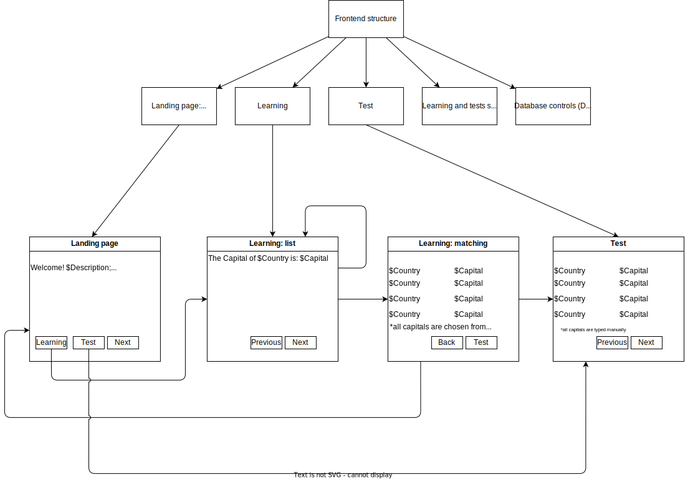
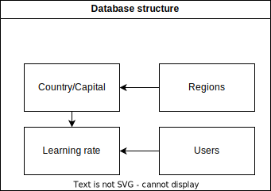

# Project structure

## Frontend structure

Frontend structure may be found on following image:

The site consists of 6 types of pages:

- Landing page, being index page of the site. It contains greetings and registration/login field as well as some statistics (if registered and signed in).
- Learning page 1, giving pairs Country-Capital for user to memorise them.
- Learning page 2, giving simple task for matching between country and its capital for user to recollect new information.
- Testing page, where user has to type in the name for each of country
- Statistics page, giving following statistics for current user:
    - Number of learned countries
    - Percentage of correctly answered test questions
    - Table of all learned countries with information on their learning rate
- Configuration page, intended to update countries database (add, update, delete), accessible for admin only.

## Backend and database entry structure

Database entry structure may be found on following image:

Default Django databases are omitted, except for Users table.

Tables are responsible for storing following data:

- Regions: table, containing regions of the world, like Asia, Africa, etc.
- Country/Capital: table, containing match between country and its capital.
- Users: table, containing data about each user. Intended to be managed by internal Django means.
- Learning rate: table, containing statistics for each country and each user. It must include:
    - number of times the country was shown
    - number of correctly answered test questions for the country
    - total number of tests where the country appeared

